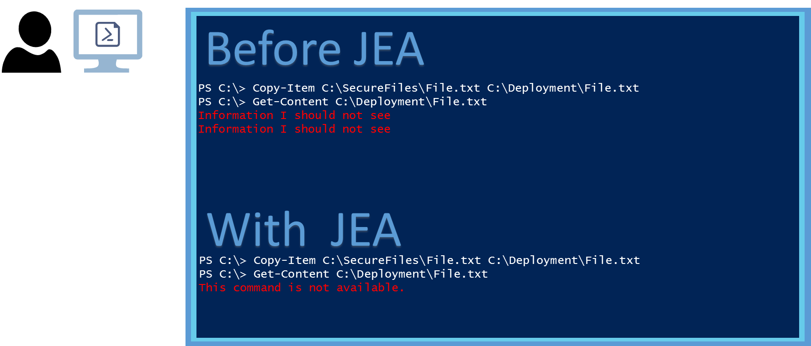

Just Enough Administration
==========================

Published: 2014

For the latest information, please see 
http://blogs.msdn.com/powershell/
and
http://aka.ms/buildingclouds

Instructions for using JEA with WMF5 have been posted in the PowerShell blog.
http://blogs.msdn.com/b/powershell/archive/2015/05/14/update-jea-for-the-april-wmf-5-0-preview.aspx

The authoritative location for the JEA Whitepaper is http://aka.ms/jea.
 
Introduction
------------
 
In the current world of Information Technology, protective measures do not stop at the network edge.  Recent news reports based on security breach post-mortems indicate the need to protect assets using measures that reduce administrative access.  While the principle of least privilege has always been known to IT Security professionals, there is a need in the industry for a standardized method of constructing an operator experience that reduces access with a more sophisticated level of granularity than what is available in many traditional access control models.
Just Enough Administration (JEA) is a solution designed to help protect Server systems.  This is accomplished by allowing specific users to perform administrative tasks on servers without giving them administrator rights, and then auditing all actions that these users performed.  JEA is based on Windows PowerShell constrained runspaces, a technology that is already being used to secure administrative tasks in environments such as Microsoft Exchange Online.

We are focusing on fortifying your existing environment, allowing you to adopt at your own pace a solution that reduces administrator exposure, and protects against lateral movement from breached machines. 

Problem Statement
-----------------

When organizations grant access to servers, a level of risk is assumed based on trust.  Traditionally, this is accomplished by granting administrative rights to users that are entrusted with IT administration.  Depending on the system, the granularity of access ranges from full control over every aspect of the system, to more granular levels where only certain components can be changed.  The access to perform specific tasks is grouped into a definition of a role, but in many circumstances, even the best-intentioned role based access control (RBAC) models still take on more risk than desired.

For example:
 - Auditors need to be given access to the environment to verify information, but should never be able to make changes.  In many cases, this requires unnecessary administrator rights for the auditor to gather information for business-critical systems.
 - “Help desk” or front line administrators who have been delegated responsibility to perform basic troubleshooting tasks on an instance of SQL Server, but should not have access to the server itself.
 - A server operator who is expected to apply the latest security updates according to what has been approved in Windows Server Update Services by a senior IT person.  This typically requires total control over the application server, either directly, or abstracted through a tool where the user theoretically could gain total control, because the changes being made are to the core operating system components.  In addition, tasks might need to be completed before and after applying the updates, such as starting and stopping services, or rebooting the hardware, so that updates to system files which are normally in use can apply during startup.
 - A service provider who is responsible for implementing changes on behalf of a tenant.  This can be a difficult model to properly implement without exposing access to tenant data.  An example would be an operator who should complete tasks–such as restarting a service during an outage–or provision an additional capability, but should not be able to log on to the tenant environment at all.
Today, it is common practice in each of these cases to grant users excessive administrative rights to perform their jobs. This results in severe consequences when accounts are breached or misused.

**Just Enough Administration**

Just Enough Administration (JEA) overcomes many of these challenges through the following benefits:
 - Users can only perform tasks that they are authorized to do as part of their role (using Windows PowerShell constrained runspaces).
 - Users perform these tasks without being given administrator rights on the server.
 - The tasks that users are allowed to perform, and the user access to the servers, are defined and managed from a central configuration server (by using Windows PowerShell Desired State Configuration). 
 - Detailed logging occurs, so that access and details of changes within an environment are always documented.
 
Solution Overview
=================

Just Enough Administration (JEA) is delivered using built-in capabilities in the Windows PowerShell scripting language.  The functionality is delivered as a Windows PowerShell Desired State Configuration (DSC) resource, so no additional binaries are required to be installed.  Although this solution is implemented in Windows, through the use of standards-based management, the technology can be applied to non-Windows systems as well.

JEA is currently delivered as a DSC Resource Kit module (xJEA), and requires the Windows Management Framework (WMF) 5.0 Preview, which only runs on the newest versions of Windows client and server, Windows 8.1 and Windows Server 2012 R2.  This Preview release will evolve rapidly, based upon community feedback; no backward compatibility is guaranteed.  The JEA toolkit will be made available on earlier releases of Windows concurrent with the availability of WMF 5.0 on those platforms.

The automation for JEA is delivered by Windows PowerShell Desired State Configuration (DSC).  The core components of a JEA environment include:
 - JEA toolkit configuration – this represents a set of tasks (for example, auditor tasks, SQL Server administrator tasks) that a user can perform on the server. This is configured through the set of Windows PowerShell cmdlets and parameters that the user can run to accomplish that task. For example, an “Auditor” JEA Toolkit includes the **Get-Events** and **Get-Logs** cmdlets. A “SQL admin” JEA Toolkit will include the Stop-Service SQL” and “Start-service SQL” cmdlets and parameters
 - JEA endpoint configuration – for each set of servers, a JEA endpoint represents an administration point for users on Windows Server. A JEA endpoint is composed of:
  - One or more JEA toolkits (for example, the “Auditor” toolkit)
  - An Access Control List (ACL) representing the users that can access the JEA endpoint (such as the Auditors_Security_Group) – These users should not be administrators on the server.
  
For employees performing their roles (such as Auditor), JEA is exposed as a Windows PowerShell session endpoint. Once connected, the JEA-based environment functions as a normal Windows PowerShell experience, with only specific commands visible, and only specific arguments or parameters accepted.  Behind the scenes, on the server, the cmdlets are running in the context of a hidden local administrator account that is specifically configured for that JEA endpoint.
 
If the employee (such as an Auditor) attempts to run an unauthorized command such as **cmd**, they get an error message, in addition to activity being logged.  This creates a “blast container” around the administrator, where even if malicious intent is present, the employees have limited impact. In addition, if the server is breached (such as by malware), no administrator credentials can be harvested to move laterally to other servers, limiting the extent of the breach to that server.

Consider an administrator who is tasked with deploying a new web-based application that includes privileged Human Resources information, such as salaries for company executives.  When the administrator connects to a JEA endpoint to complete work, he or she would be presented with options such as:
 - New-WebApplication
 - Set-WebContent
 - Restart-WebApplication
 - Test-WebApplication
 
Notice that the names of the commands align with the work to be performed.  No additional commands, such as those commonly used to view data, or copy the content to the administrator’s workstation, are available.

Further, the parameters for each command, and the values that are accepted, can be restricted.  Consider the following scenario, using restrictions for the above commands and the benefit for each.
 - New-WebApplication –Server (specific web servers)
  - Deploy only on the web servers where the application should be deployed, and nowhere else.
 - Set-WebContent –Source (secure location) –Destination (secure location)
  - Provision content from a secure location to a secure location, without having a way to view the data, or copy it to a less secure location.
 - Restart-WebApplication –Application (specific application)
  - Perform maintenance tasks without having long term access to the application.
 - Test-WebApplication –Application
  - Validate health of the application through synthetic transactions without having access to the application.
  
In each of the preceding examples, the command might actually support additional parameters, but the properties of the Windows PowerShell session for the JEA endpoint restrict those parameters.  The session properties also validate the arguments.  If the administrator attempted to do something malicious, such as copying secure content to an insecure location, not only would the properties of the session prevent the command from running, the details of the attempt would be written to audit logs. 

Technical Overview
==================

JEA consists of Windows PowerShell Desired State Configuration resources and configuration scripts that together provide a simplified method of constructing and managing constrained endpoints that adhere to prescribed boundaries.

Windows PowerShell constrained endpoints offer rich functionality that could be considered complex to configure and implement, especially at scale.  JEA simplifies constrained endpoints to make the concept easier to implement and manage by using the concept of toolkits.

To better understand how JEA works, first understand the core constructs that Windows PowerShell leverages to create the JEA environment.

For specific examples of each solution, see the respective ‘How-To’ sections later in this document.

Windows PowerShell Desired State Configuration
----------------------------------------------

Windows PowerShell Desired State Configuration (DSC) provides a method of using script files to apply, monitor, and/or maintain a configuration in declarative language.  DSC scripts packaged as Windows PowerShell modules, ready to be consumed, are named DSC resources.  A DSC resource consists of idempotent functions, meaning the script defines a configuration in such a way that it can be run multiple times on the same device without error or undesired outcomes.

To take advantage of a resource after it has been copied to a device, a script is run to define a configuration, known as the configuration script.  The configuration script is organized into human-readable sections, each representing a set of declarative statements that are used as parameters when you are running functions from each resource.  The information is stored as a Managed Object Framework (MOF) file in Windows, and then applied to the device.

In the following example, the **Configuration** section defines a configuration that includes installation of the Hyper-V role on Windows Server.  Next, the configuration is run by calling Example to create a MOF file.  Finally, **Start-DSCConfiguration** tells Windows to apply the configuration with verbose output, and to wait for all changes to complete before exiting.

*Configuration Example*

    {
       Node 'localhost'
        {
    
            WindowsFeature Hyper-V
            {
                Ensure = 'Present'
                Name = 'Hyper-V'
            }
        }
    }
    Example -OutputPath .\Example
    
    Start-DscConfiguration -wait -force -verbose -path .\Example

For JEA, DSC is used for installation and configuration of JEA toolkits and endpoints on a server by using the same approach.  Just as we see **WindowsFeature Hyper-V** in the example, we would expect to see **JEAEndPoint Hyper-V** if we are constructing an endpoint where an operator would performance maintenance on a Hyper-V server.
 
DSC has two modes – Push, where an administrator remotely configures servers (known as “target nodes”) by specifying the **ComputerName** parameter when running **Start-DSCConfiguration** from a local computer, and Pull, where a target node is configured to periodically  retrieve the configuration from a central DSC server (the “pull server”). Both models enable deployment at scan, and can be used for applying JEA endpoint configurations to servers.
 
Windows PowerShell Constrained Endpoints
----------------------------------------

When a user opens Windows PowerShell by using the traditional method of clicking on the desktop icon, all modules and snap-ins available on that machine are visible.  This can be demonstrated with the **Get-Command** cmdlet.  A user opening a Windows PowerShell 4.0 prompt is greeted with over a thousand built-in commands.

The concept of a session was introduced with Windows PowerShell remoting as the WinRM runspace to which a remote user connects.  Sessions are not limited to remote connections.  A local user can also create and enter a Windows PowerShell session.  The remoting context leads to sessions being referred to as endpoints.

When a session is created, it is possible to apply restrictions.  The basic method for restricting a session is through the use of Windows PowerShell session configuration files, or Windows PowerShell session startup scripts.  Startup scripts are the most flexible, and allow for advanced configurations through the use of the Windows PowerShell script language.  These capabilities include strict limits on which commands should be available, including *Language Modes* as described in the Appendix of this document.

For JEA, Windows PowerShell constrained endpoints provide a remotely-accessible Windows PowerShell session with defined characteristics that limit what functionality is available to the user.  An example endpoint configuration is provided in the How-To section of this document.

JEA Toolkit
-----------

A JEA toolkit serves as a definition of the commands that should be available for a JEA endpoint.  The definition can be set directly within a configuration script by using a string value, or through a CSV (comma separated values) file that is implemented in the configuration script by running the **Get-Content** cmdlet.  The value of authoring toolkits by using a CSV file is to simplify the experience into one that can be driven by any text editor or spreadsheet application.

The toolkit file is simply a flat text file that contains comma-separated values, and that uses a schema that is expected by the JEA initialization script.  A simple method for editing the file is to open it in Microsoft Office Excel, add contents to each cell, and then save it as a CSV file type when finished.

The schema is as follows:

| ModuleName | Name | Parameter | ValidateSet | ValidatePattern | ParameterType
|:---|:---|:---|:---|:---|:---
| The name of the module whose cmdlets should be available. | The cmdlet that should be available in the session. | Specifies a parameter that should be allowed.  Repeat one row per parameter.  Default = blank (all) | If you want a parameter to accept only specific values, optionally list a semicolon-separated validation set to restrict a set of arguments.  Default = blank (all) | If you want a parameter to accept only values in specific formats, as an alternative to ValidateSet, you can validate a Regular Expression pattern for arguments.  Default = blank (all) | If you want a parameter to accept only specific types of data, such as strings, you can set the Type to ensure only valid data is passed.

An example toolkit configuration is provided in the How-To section of this document.

When JEA endpoints are created by the DSC configuration, the following set of functions are always available to the operator.  These will be presented in addition to those defined in the Toolkit and are intended to provide a good interactive experience.

    EXIT-PSSESSION
    FORMAT-LIST
    FORMAT-TABLE
    GET-COMMAND
    GET-FORMATDATA
    GET-HELP
    GET-MODULE
    MEASURE-OBJECT
    OUT-DEFAULT
    PROMPT
    SELECT-OBJECT
    TABEXPANSION2
    WHOAMI

Understanding Use of Administrative Accounts
--------------------------------------------

As we’ve mentioned, when a user connects to a JEA endpoint by using a remote session, that user should not be an administrator on the server. Having said that, some (or all) of the cmdlets that the user runs require administrator rights. For example, if a user must restart a service, this is an operation that standard users cannot do on a server.
The way this is addressed in the JEA endpoint is that while the user is connecting to the server as a standard user, the JEA endpoint performs a “Run as” operation by using a special local administrator account that is configured for that JEA endpoint, so that the user can perform the administrative operations (while still limited to a specific set of cmdlets).
This special local administrator account is created automatically by the JEA endpoint DSC resource when the JEA endpoint is configured, and is only used by that JEA endpoint.
Each JEA endpoint on a server has its own local administrator account, and these accounts have randomized passwords that are maintained by the JEA endpoints. As these accounts are local to each server, a compromised server will not lead to a lateral movement attack on other servers.

One consequence of the “Run as” operation is that the user who is connected to the JEA endpoint is very limited when trying to perform off-server actions such as access to an SMB share (because the JEA endpoint runas account is local to the server). The users can still perform off-server actions by providing their credentials. This behavior is by design, so that users are not able to use JEA to exploit areas to which they do not have proper access, and it satisfies the need for an appropriate audit trail when the users access off-server resources.

Logging and Reporting
---------------------

All operations that are performed through the JEA endpoint are recorded in the Windows Event Logs; all commands run in a JEA session are logged to the *Microsoft-Windows-PowerShell/Operational* channel.  When an end user logs on to a Windows PowerShell session, the process ID, RunSpaceID, and information from WinRM are written as Windows events.  Because events generated by work in JEA are recorded as actions performed by the JEA account, to trace them to the user who actually performed the work, a record of the user and what runspaceID is created for that user is logged in $env:ProgramFiles\Jea\Activity\Activity.csv.  Additionally, information about the WinRM session is written to the Windows Event Log.

In a centrally-managed environment, these event logs provide a method of data correlation to determine who accessed the environment, when, and what changes were made.  To form a complete picture, the data correlation must include details about the actions taken in the context of the JSA user account, and the logged-on operator.
 
How-To: Install JEA
===================

The JEA installation process includes the DSC resource ‘xJEA’ that is copied to the local computer’s Modules folder, followed by a DSC Configuration script that creates and applies JEA endpoints.

This process is the same for both simple and complex environments, and it is idempotent.  This means you can define one endpoint or many endpoints in the same script, and apply it to a server.  To modify the server, you only need to run the same script again with different settings.

Load the xJEA resource
----------------------

The first step is to load the xJEA resource on each server where an endpoint should be created.  The following methods provide flexible options for loading the DSC resource xJEA.

Manual installation
-------------------

To install JEA manually, first get the xJEA DSC resource from the Windows PowerShell Desired State Configuration Resource Kit, available online at http://gallery.technet.microsoft.com/scriptcenter/DSC-Resource-Kit-All-c449312d.

Extract the files from the downloaded archive (.zip) file, and copy the folder to the following location:
'C:\Program Files\WindowsPowerShell\Modules' 

The xJEA folder should appear in the root of the Modules directory.  The contents of the xJEA folder should include an xJea.psd1 file, and a folder named DSCResources.

Install by running Install-Module
---------------------------------

The new Windows PowerShell Install-Module cmdlet (available in the Windows Management Framework 5.0 May 2014 Preview) simplifies the process of installation to a one-line command when an Internet connection is available.  The xJEA module is downloaded using PowerShellGet and copied to the Modules folder in the Program Files directory of the local computer.  Currently, Install-Module must be run in the context of a user account.  This means the scenario for this method of installation would be an administrator who is logging on to the server and installing JEA.

After the PowerShellGet module is installed on the node, the command to load the xJEA resource is the following:

    Install-Module xJEA

Using a Windows a PowerShell DSC Pull Server
--------------------------------------------

A server configured to act as a DSC “pull server” acts as a centralized point for storing DSC resources and MOF files created by DSC configuration scripts, allowing servers managed by DSC to be deployed and maintained in an automated fashion.

More information about configuration of a DSC “pull server” is available at the Windows PowerShell blog:
http://blogs.msdn.com/b/powershell/archive/2013/11/21/powershell-dsc-resource-for-configuring-pull-server-environment.aspx

To support delivery of the JEA resource, download the xJEA DSC resource and copy it in to the appropriate folder on the “pull server”:

    'C:\ProgramData\PSDSCPullServer\Modules' 

Full details about how to configure the DSC server are available in the blog post linked above.

Apply the DSC configuration
---------------------------

After the xJEA resource has been copied to the local computer, the second step is to create the JEA toolkits and endpoints.  Both are defined in declarative language by using a DSC configuration.  To make it easy for testing, an example configuration script is included with the download for the toolkit.  The critical components of the configuration script are the helper functions, the JEAToolKit resource, and the JEAEndPoint resource.

The basic sections of a DSC configuration for JEA include a JEAToolkit and JEAEndPoint.

JEAToolkit
----------

The JEAToolkit section of a DSC configuration script defines what commands should be available inside a JEA session.  The properties include **Name**, **CommandSpecs**, **Applications**, and **Ensure**.  The information provided in **CommandSpecs** is parsed as comma-separated values, which makes content creation very simple in any text editor or spreadsheet application.
Importing the information into a configuration script can be done either directly by using a here-string value, or by importing information from a stored .csv file.

To create a new toolkit – create a new **JEAToolkit** configuration in the script and set the properties, as in the example below.  In this example, the toolkit is created by using a CSV file for ease of authoring.  The result allows a connected user to run Get-EventLog, **Get-Content** with only the **-Name** parameter, **ipconfig**, and nothing else.

*JeaToolkit ExampleToolkit*

    {
        Name = "Auditor toolkit"
        CommandSpecs = Get-Content “C:\AuditorToolkit\Toolkit.csv” –Delimiter “NoSuch”
        applications = "ipconfig"
    } 

The preceding script loads the contents of the specified CSV file. You can create the CSV file by using Microsoft Office Excel or any text editor.  An example of the content is shown below.  Once you have created this table in Excel, click **Save As** to change the file type to CSV (comma deliminted) (*.csv).

| Module | Name | Parameter | ValidateSet | ValidatePattern
|:---|:---|:---|:---|:---
| | Get-EventLog | -LogName | Application | |
| |	Get-Content | -Path | | C:\logs*.txt |

To create additional toolkits in the same configuration, repeat this section using a different name for each.

JEAEndPoint
-----------

The **JEAEndPoint** section of a DSC configuration script defines the metadata properties for the session that will be created.  The properties include **Name**, **Toolkits**, **SecurityDescriptorSddl**, **Group**, **CleanAll**, and **Ensure**.  The table below includes a definition for each property.

| Property | Description
|:---|:---|
Ensure | Defines whether the endpoint should be created or removed.
Name | Sets a name for the registered endpoint.  This is used by operators to select the endpoint to which they should connect.
Toolkits | The JEA toolkits that should be available from this endpoint.
SecurityDescriptorSddl | An SDDL that defines access for the session.
Group | The local user group of which the account created to host the session should be a member.  If not provided, defaults to **Administrators**.
CleanAll | Boolean value that when set to **True** removes all endpoint configurations from the endpoint server.
  
To create a JEA endPoint, create a **JEAEndPoint** configuration in the DSC configuration script, and set each of the properties.  In this example, the endpoint publishes the toolkit defined in the example above.

      JeaEndPoint AuditorEndPoint
      {
          Name      = 'Auditor EndPoint'
          Ensure    = 'Present'
          Toolkit = ‘AuditorToolkit’
          DependsOn = '[JeaToolkit]AuditorToolkit'
      } 

It is also possible to define an endpoint with multiple toolkits available.

      JeaEndPoint AuditorEndPoint
      {
          Name      = 'Auditor EndPoint'
          Ensure    = 'Present'
          Toolkit = ‘AuditorToolkit’,’Auditor2Toolkit’,’Auditor3Toolkit’
          DependsOn = '[JeaToolkit]AuditorToolkit', '[JeaToolkit]Auditor2Toolkit', '[JeaToolkit]Auditor3Toolkit'
      } 

To create additional endpoints in the same configuration, repeat this section by using a different name for each endpoint.
This information is passed to the **JEAEndPoint** resource that creates the actual Windows PowerShell constrained endpoint.  The following changes result:
 - A local account is automatically created named **JSA-<name>** based on the **Name** property.  
 - A random password is generated, and the account password is reset.  
 - An initialization script is created for the session and the session is registered on the host.
   
The default Group and SDDL values permit anyone who is a local administrator on the host to connect to the session. 

Example - DSC Script
--------------------

To test a fully-functional configuration script, open the .ps1 file included in the root of the xJEA download.

*configuration Demo2*

    {
        Import-DscResource -module xjea
    
        xJeaToolKit Demo2Toolkit
        {
            Name         = 'Demo2Toolkit'
            CommandSpecs = @"
    name,Parameter,ValidateSet,ValidatePattern
    Get-Process
    Get-Service
    stop-process,name,calc;notepad
    restart-service,name,,^A
    "@
        }
        xJeaEndPoint Demo2EP
        {
            Name        = 'Demo2EP'
            Toolkit     = 'Demo2Toolkit'
            DependsOn = '[xJeaToolKit]Demo2Toolkit'
        }
    }
    
    Demo2 -OutputPath C:\DSCDemo
    
    Start-DscConfiguration -Path C:\DSCDemo -ComputerName localhost -Verbose -wait 

 
How-To: Create a Custom Proxy Function
======================================

In addition to the security benefits of JEA, it is also possible to create custom proxy functions that simplify the operator experience.  You do this by authoring a Windows PowerShell module (.psm1), loading it on the endpoint server, and then surfacing the functions by using the JEA toolkit.  As an example, rather than giving an operator access to the native Windows PowerShell cmdlet for **Get-Content** to read in the top 100 lines of a specific log file, you can instead surface a command with a name that is friendlier to the context of the task, such as **Get-LogFile**.

In this example, the following text is saved as a .psm1 file, and then copied to the **Modules** folder on the endpoint server.  The file creation can also be automated by using the DSC **File** resource.

    function Get-LogFile {
        Get-Content -Path C:\Log0001.txt  | Select -first 100
        } 

Next, in the toolkit CSV file, add the following entry to make the command visible.

| Module | Name | Parameter | ValidateSet | ValidatePattern
|:---|:---|:---|:---|:---|
| | Get-LogFile | | | |			

The operator now has a simplified experience with task-associated command names, and does not have to provide parameters or values, meaning that the domain knowledge required to find the log file or file name is no longer required.

In circumstances where value or pattern validation is complex, custom proxy functions can simplify the effort that restricts what actions are available to the operator by surfacing the task that should be performed in a function that hides native commands.  This reduces the risk of toolkit errors that inadvertently expose an unintended parameter or command. 

How-To: Access a JEA session
============================

When a user wants to connect to a JEA endpoint to perform work, the process is the same as connecting to any remote Windows PowerShell session, with one difference: they must specify the configuration name.  The configuration name is the name of the **JEAEndPoint** that is specified in the DSC configuration script.  

More information about Windows PowerShell remoting is available in the online documentation: http://technet.microsoft.com/library/dd347744.aspx.

In most cases, users connect from their workstation, and might prefer a persistent session, meaning that the session should remain available even when they are not actively doing work.  In a trusted environment, such as when both the workstation and the JEA endpoint servers are all members of the same Active Directory Domain Services environment, credentials are passed automatically by using Kerberos.  In untrusted scenarios, credentials must first be stored, and then provided by the user when she or he is connecting.

*Example – Connecting to Remote JEA*

    $Session = New-PSSession -ConfigurationName JEAEndPointName -ComputerName Remote_Computer_Name
    
    Enter-PSSession $Session 

 
Appendix
========

User Context and Toolkit Security
---------------------------------

When an operator connects to a JEA endpoint, the authentication to the Windows PowerShell session validates that they have permission to connect.  The endpoint configuration defines a Run As account for the session.  When the session is registered, a local user is created with the name pattern JSA-<name>, meaning JEA session account followed by a dash, and then the name of the endpoint.  A randomly-generated secure password is set for the account, and it is added to the computer’s local Administrators group.

After entering the PS session, the operator’s security context is not his or her own account; it is the context of the JSA account, with limited visibility to commands which prevents unrestricted action.  This is by-design, to create a ‘blast container’ where operators can make approved changes to the local computer, without their own accounts ever having permission.

To make changes to a remote server or an application on the local host that does not inherit permissions from the local computer groups, the operator must provide credentials in the session.
It is important when constructing a new toolkit to understand this model, and ensure no commands are ever made visible in a session that could be used by malicious users to give themselves additional access.

Language Mode
-------------

Windows PowerShell includes the ability to restrict the elements of the Windows PowerShell language available within a session.  This is a built-in method for preventing access to common Windows PowerShell tools which, while convenient and useful in everyday scripting and command execution, could be used by an administrator in a constrained session to “break out” of the restricted environment, and give themselves more access than they should have.

The scripts in the DSC resource xJEA automate the configuration of the Windows PowerShell session, and set the LanguageMode property to NoLanguage.  This is the most restrictive setting available.

For more information about Windows PowerShell language modes, see the following documentation: http://technet.microsoft.com/library/dn433292.aspx.
